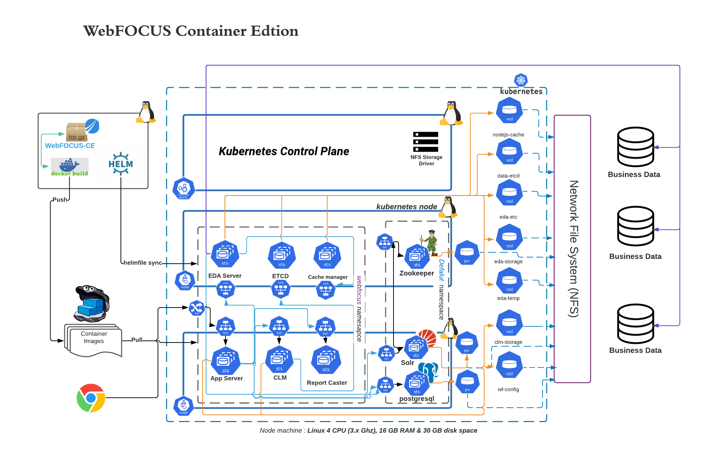
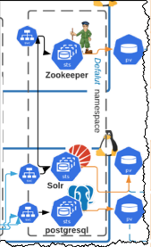
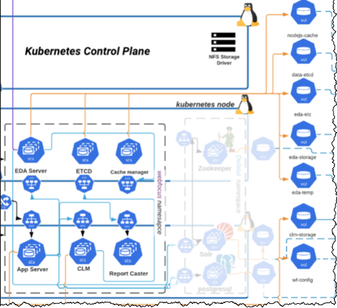
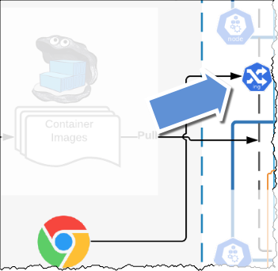
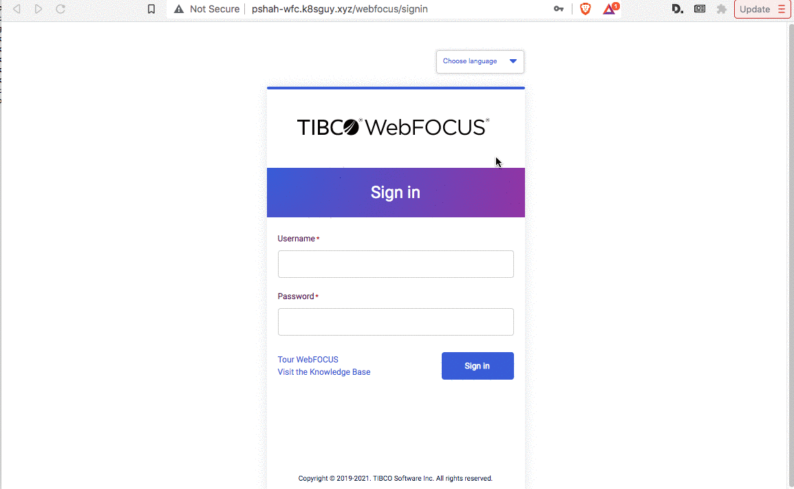

# Demo - WebFOCUS CE (Sep 22)

# Introduction 

In this demo we will deploy WebFOCUS CE ("BETA") and needed ancillary tools on EKS Cluster that is already pre-created 

# Final topology 

At the end our installation we will end-up with setup like this 



# Steps 

## Install ancillary tools 

This step will install - Postgres DB, Apache Solr and Apache Zookeeper. This all are needed for WebFOCUS CE to run



### Command 

```
cd ~/webfocus-ce/scripts/helmfile/infra  
helmfile sync
```

### Sample output 

If helm file succeeds than if you run `get pods` command in default namespace you should see output like below 

```bash
ubuntu-pshah@ip-172-31-38-9:~/webfocus-ce/scripts/helmfile/infra$kubectl get pod
NAME                      READY   STATUS    RESTARTS   AGE
postgresql-postgresql-0   2/2     Running   0          4m51s
solr-0                    1/1     Running   0          4m12s
solr-1                    1/1     Running   0          4m14s
solr-2                    1/1     Running   0          4m22s
solr-zookeeper-0          2/2     Running   0          4m27s
```

## Install WebFOCUS components 

This step will install all of WebFOCUS CE components - exactly one copy of each 



### Declare 4 needed environment variables 

```bash
export PLATFORM_NAME=webfocus
export RS_TAG=wfs-8207.28-beta-v32
export WF_TAG=wfc-8207.28-beta-v32
export ETC_TAG=wfs-etc-8207.28-beta-v32
```
### Run helmfile sync 

```
cd ~/webfocus-ce/scripts/helmfile/
helmfile -e aws --state-values-set swego.enabled=true sync
```
### Sample output 

At the end if you run command `kubectl get pods -n webfocus` you should see all WebFOCUS CE components running in `webfocus` namespace 

```bash
ubuntu-pshah@ip-172-31-38-9:~/webfocus-ce/scripts/helmfile$kubectl get pods -n webfocus
NAME                     READY   STATUS    RESTARTS   AGE
appserver-0              1/1     Running   0          3m55s
cachemanager-0           1/1     Running   0          11m
clm-0                    1/1     Running   0          9m12s
edaserver-0              1/1     Running   0          5m49s
etcd-0                   1/1     Running   0          13m
reportcaster-0           1/1     Running   0          3m55s
swego-5c87cf45df-86wgg   1/1     Running   0          10m
```

### Helm way of checking 

We can also use `helmfile list` command to see if all charts are enabled successfully or not 

```bash
ubuntu-pshah@ip-172-31-38-9:~/webfocus-ce/scripts/helmfile$helmfile list
NAME                      	NAMESPACE    	ENABLED	LABELS     	CHART                 	VERSION
init-solr                 	default      	true   	           	incubator/raw         	0.2.3
webfocus                  	ibi-platforms	true   	tenant:true	incubator/raw         	0.2.3
infra                     	webfocus     	true   	tenant:true	incubator/raw         	0.2.3
create-pv-eda-storage     	webfocus     	true   	server:true	incubator/raw         	0.2.3
create-pv-eda-etc         	webfocus     	true   	server:true	incubator/raw         	0.2.3
create-pv-eda-temp        	webfocus     	true   	server:true	incubator/raw         	0.2.3
create-pv-nodejs-cache    	webfocus     	true   	server:true	incubator/raw         	0.2.3
create-pv-clm-storage     	webfocus     	true   	server:true	incubator/raw         	0.2.3
create-pv-webfocus        	webfocus     	true   	tenant:true	incubator/raw         	0.2.3
copy-etc-to-volume-eda-etc	webfocus     	true   	server:true	incubator/raw         	0.2.3
etcd                      	webfocus     	true   	server:true	bitnami/etcd          	5.3.0
cachemanager              	webfocus     	true   	           	../charts/cachemanager	1.0.0-beta
clm                       	webfocus     	true   	server:true	../charts/edaserver   	1.0.0-beta
edaserver                 	webfocus     	true   	server:true	../charts/edaserver   	1.0.0-beta
appserver                 	webfocus     	true   	tenant:true	../charts/appserver   	1.0.0-beta
```

## Enable NGINX Ingress for `appserver`

Since WebFOCUS is running in EKS we need to create NGINX ingress resource that in-turn will create ELB ( Load balancer)




### Command to create Ingress 

`kubectl replace -f https://raw.githubusercontent.com/ishswar/octant-service/master/sample-ingress.yaml` 

## Access Web GUI to see things are installed 

At the end if all of above helm file `sync` secedes than you should be able to access WebFOCUS GUI using URL like this :

[WebFOCUS Client](http://pshah-wfc.k8sguy.xyz/webfocus/signin 'WebFOCUS Client')

